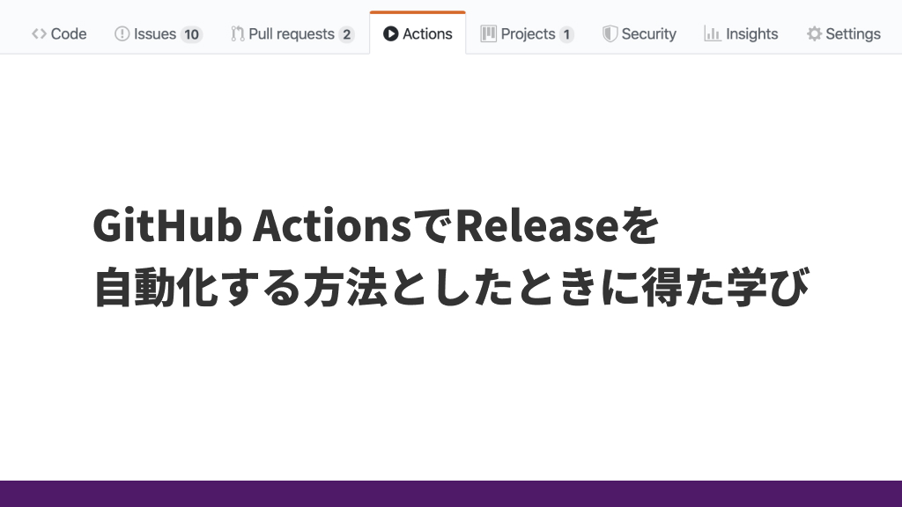

どうも、sKawashimaです。

最近 **GitHub Actionsでデプロイやファイル加工を自動化すること** がクセになりつつあります。
以前はプライベートリポジトリでも無料で使えるWerckerを使ってましたが、 **GitHub Actionsは早くて無料で最高** です！

というわけで、そんな中でも地味にハマった「GitHub ActionsでReleaseを自動化する方法」、やっていきます。

今回はGitHub Actionの基本のキみたいなところは割愛します。
需要有れば書くので、 [Twitter](https://twitter.com/_skawashima) にでも連絡ください。

**GitHub Actionは利用を申し込めば誰でも使える** 機能なので、「そんなタブがないぞ」という方は調べて申し込んでください。
最低限、 **特定のコマンドを叩いてReleaseするファイルを出力できる方なら誰でもできる** と思います。

<!-- more -->

---

## 目次

<!-- toc -->

## 基本的な処理の流れ

基本的な処理の流れは、 **GitHubへのTagのPushを検知→データ加工→Release発行** です。

1. 特定のCommitに対して **Tag** をつけてPushし、それをGtiHub Action側で検知する
2. リポジトリのデータからRelease発行するための **データを作成** する
3. Release発行する

本当にこれだけです。
2つめの「データ加工」に関しては、GitHub上に配布するデータ（Zipなど）を生成してコミットしてるよ！という方やソースコードをリリースできれば大丈夫だよ！という方は **スルーしても大丈夫** です。
が、一応 **Releaseのためのデータ加工をGitHub Actionsで自動化するメリットも触れる** ので読んでいただければと思います。

やっていきましょう。

## GitHubへのTagのPushを検知

まずはGitHub Actionsが作動するトリガーを作ってあげます。
`.github/workflows/release.yml` みたいな感じでファイルを作ってあげて、だいたいこんな感じに書いていきます。

```yml
name: release

on:
  push:
    tags:
      - 'v*'
```

`name` は表示名なので適当です。なんでも良いです。

トリガーを定義する `on` 句は **「`v`から始まるTagがPushされたら」** という条件になります。
後に詳しく解説しますが、 **TagのPush以外をトリガーに出来ませんでした** 。

GitのTagがわからない人の為に一応解説すると、Releaseする時にはRelease発行したい状態のリポジトリで以下のようなコマンドを実行するイメージです。

```shell
git tag v1.0
git push origin --tags
```

`v` がついたタグ名を設定→それをGitHubにPushというシンプルなコマンドで、それをGitHub Actionsに検知させる、という感じです。

## データ加工

よしなに。

では流石に終わらせられないですが、ざっくり `出力ファイルを生成` → `Zipに圧縮` くらいできれば上々だと思います。

### 出力ファイルを生成

まず生成から見ていきますが、これは**言語によって大きく異なるので深くは触れません**。
例えばNode.jsのプロジェクトだったら、以下のような感じです。

```yml
# ↑のものに追記する分

jobs:
  convert:

    runs-on: ubuntu-latest

    strategy:
      matrix:
        node-version: [12.x]

    steps:
    - uses: actions/checkout@v1
    - name: Use Node.js ${{ matrix.node-version }}
      uses: actions/setup-node@v1
      with:
        node-version: ${{ matrix.node-version }}

    - name: npm install, build, and test # ここのrunに生成コマンドを入れる
      run: |
        npm ci
        npm run build
      env:
        CI: true
```

お察しの方もいるかも知れませんが、GitHub Actionsのテンプレートほぼそのままです。
**なんだかんだ公式テンプレートは有能** なので、活用していきましょう💪

大事なのは、 **ignoreされていてもいいのでどこにファイルが生成されるかを把握すること** です。
把握は大丈夫ですか？
では進めましょう。

### Zipに圧縮

これはシンプルに **Shellコマンドの話** ですね。
例えば、 `output` フォルダにファイルが生成されるなら以下のようなstepsを追加します。

```yml
    - name: Zip output
      run: |
        cd output
        zip release *.*
```

まあ、詳しく知りたい人はShellコマンドの **`zip`コマンドを調べてみてください** 。
ただ、こちらも **Zipファイルが`output/release.zip`として生成されることは把握しておくように** しましょう。

### 閑話休題：Releaseのためのデータ加工をGitHub Actionsで自動化するメリット

ざっくり分けると以下の2つのようなメリットがあります。

1. Git上に出力後のデータ（=生成できるデータやバイナリデータ）を管理しなくて良くなり、 **差分管理がシンプルになる**
2. **複雑な生成処理を手元で行わずにGitHub Actionsに任せることが出来るので、事前処理がなくなる**

すばらしいですよね？

特に2に関しては、「Node.jsのライブラリによる処理を実行後にRuby Gemによる処理の実行」みたいなのって、環境構築が面倒かつブレやすいので面倒です。
まあそんなことめったに無いと思いますが（最近やった）、 **GitHub Actionsは実質Dockerみたいな安定した実行環境** なので、使えるところは使っていきましょう。
例えばNode.jsの環境でRubyを使いたくなったら、 **公式用テンプレートのRubyから以下のようなSet up stepをコピペ** してくれば以降で `gem` コマンドも使えるようになります。

```yml
    - name: Set up Ruby 2.6
      uses: actions/setup-ruby@v1
      with:
        ruby-version: 2.6.x
```

## Release発行

やっと本題。Releaseを発行していきますよ。

と意気込みましたが、ここからはそんなに難しくありません。
というのも、公開されているActionsである `create-release` と `upload-release-asset` を使えば一瞬だからです。
Actionsの名前から察した方もいるかと思いますが、 **Release発行（タグ指定のみ）→ファイルアップロードの順** でやっていきます。
順番に見ていきましょう。

### Release発行（タグ指定のみ）

公開Actionsである `create-release` を使用します。
といっても、これはActionsの解説ページに載っているものをコピペで大丈夫です。

具体的にはこんな感じ。

```yml
    - name: Create release
      id: create_release
      uses: actions/create-release@v1.0.0
      env:
        GITHUB_TOKEN: ${{ secrets.GITHUB_TOKEN }}
      with:
        tag_name: ${{ github.ref }}
        release_name: Release ${{ github.ref }}
        draft: false
        prerelease: false
```

`uses` 句で使用するActionsを呼び出し、 `with` 句で引数を与えています。

ここで、慣れていない方は環境変数宣言の `env` 句や `with` 句の中の変数に戸惑うかもしれませんが、 **`secrets.GITHUB_TOKEN`や`github.ref`はシステム側が定義している環境変数**なので、**我々がしなければならない設定は特にありません** 。

ので、ここは本当にこれだけです。

**Release発行に含ませる生成ファイルがない人はここまで** ですね。
一足早く、お疲れさまでした。

### ファイルアップロード

で、Releaseにファイルアップロードする件ですね。
ファイル生成の際に把握しておくように述べていたファイルパスを使うときが来ました。

こちらも公開Actionsである `upload-release-asset` を用いますので、公式のstepsをコピペして、その後編集していきます。

具体的には例えばこんな感じ。

```yml
    - name: Upload Release Asset
      id: upload-release-asset
      uses: actions/upload-release-asset@v1.0.1
      env:
        GITHUB_TOKEN: ${{ secrets.GITHUB_TOKEN }}
      with:
        upload_url: ${{ steps.create_release.outputs.upload_url }}
        asset_path: ./output/release.zip
        asset_name: meu.zip
        asset_content_type: application/zip
```

ここでも、 `uses` 句で使用するActionsを呼び出し、 `with` 句で引数を与えています。
新たに出てきた `steps.create~` という変数もまた **システム側が勝手に持ってくれるもの** です。

我々が編集するのは、 `with` 句内の以下のものです。

- `asset_path` ： **生成したファイルのパス** （さっき生成したファイルのパス）
- `asset_name` ： **公開するZipファイルの名前**

お？と思われた方もいらっしゃるかもしれませんが、生成したファイルの公開時のファイルパスはここで定義します。

ここまでくれば、 **このworkflowを定義したymlファイルをGitHubのmasterブランチに入れてから、先にも書いたGit TagのPushをすれば自動でReleaseされるようGitHub Actionsが走るはず** です。

```shell
git tag v1.0
git push origin --tags
```

お疲れ様でした。

## やりながら学んだこと

### Git Tagの存在

今回の学びポイント。

恥ずかしながら、 **これまで`git tag`なんて打ったこともありませんでした** 。
これ、Release以外のタイミングで多分滅多に使わない機能ですよね…

なかなか、マニアックな機能を触ったなあ…という気分になりました。
でも、知れてよかったです。

### このやり方ではMasterへのPush(Pull Request のMerge)をトリガーに出来ない

さて、これが今回のハマリポイント。

MasterにPushされたら、Pull RequestがMergeされたら自動でよしなに〜が理想だったんですが、

- `github.ref` が毎回同じ文字列になってしまう
  - **Git Tagは重複できないのでエラー**
- `npm version` みたいな **直近のバージョンからよしなにやってくれるシステムがない**
  - 有志がつくるには元システムの自由度が高すぎるので難しい

などの理由で **出来ませんでした** 。

厳しかった…。

この件はここまで。

では。
