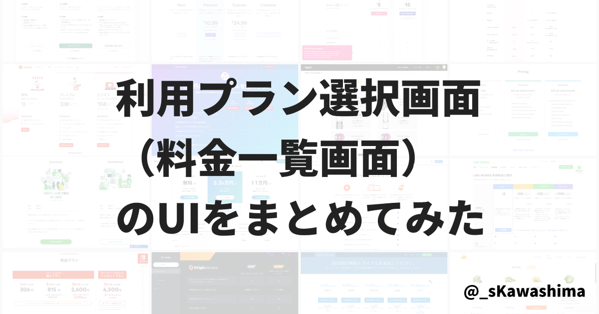

イントロ。

チェックポイントは以下の通り。

* プラン数
* プラン命名
* 無料プランとの比較の有無
* デザイン分類
* デザインから受ける印象

<!-- more -->

---

### 目次

<!-- toc -->

## 概要

### プランの数

2~5
でも5は多い。

### プランの命名

### デザインをカテゴライズしてみる

## 調べたものを詳しく紹介

### Apple Music

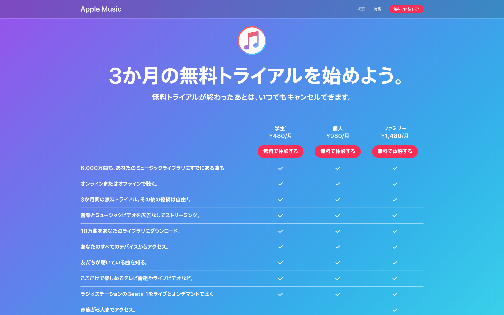

#### プラン数

3

#### プラン命名

利用者属性型（学生、個人、ファミリー）

#### 無料プランとの比較の有無

無し

#### デザイン分類

リスト型

#### デザインから受ける印象

言葉遣いが「Apple」感。

かっこいいイメージは有るが、ちゃんと読まないと理解が出来ない。
比較部は出来ること一覧としての機能としてデザインされていそう。

### Asana

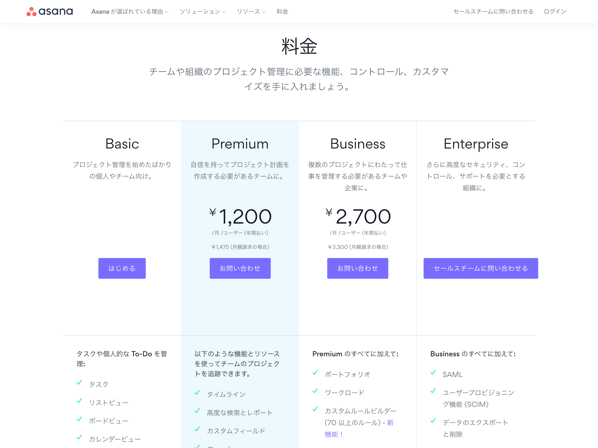

#### プラン数

4

#### プラン命名

上昇型（Basic、Premium、Business、Enterprise）

#### 無料プランとの比較の有無

有り

#### デザイン分類

テーブル型

#### デザインから受ける印象

シンプル。

下の方にはずらっとした機能表がある。
機能表は（1つ安いプラン）のすべてに加えて〜という表記がされている。

### Dribbble

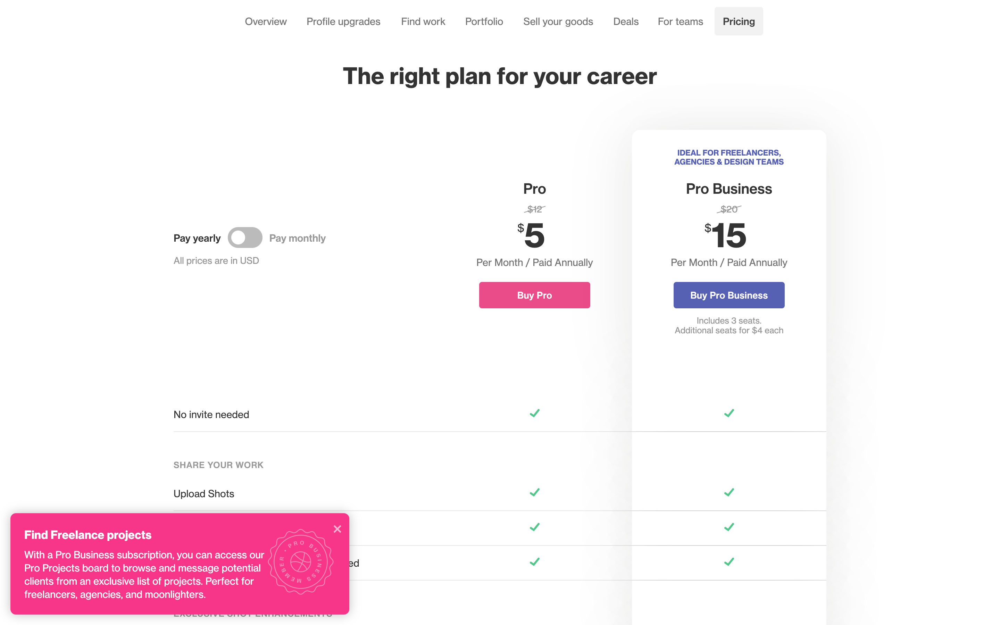

#### プラン数

2

#### プラン命名

上昇型（Pro、Pro Business）

#### 無料プランとの比較の有無

無し

#### デザイン分類

テーブル型

#### デザインから受ける印象

高い方のプランを白く浮かせることでそちらのほうが目立たせている。
要素が2つなので余白感がすごい。

### Dyton Technology +

#### プラン数

2段階 × 3種類

#### プラン命名

サービス特徴型（アドバンスプラン、パフォーマンスプラン）

#### 無料プランとの比較の有無

無し（無料プランが存在しない）

#### デザイン分類

タイル型

#### デザインから受ける印象

最初、設定期間が長いほうが月額も安いのかな？と勘違いしたが、実際はアドバンスプランの方が諸々上位互換。

左側に上位互換を持ってくる数少ない事例。

### Figma

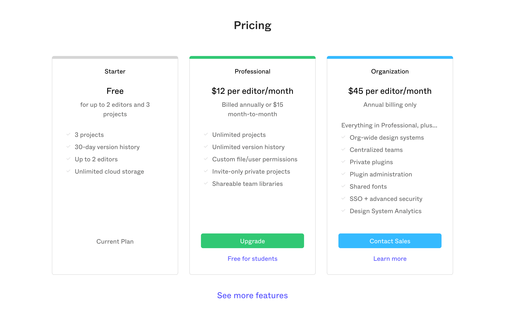

#### プラン数

3

#### プラン命名

サービス利用の熟練度型（Starter、Professional、Organization）

#### 無料プランとの比較の有無

有り

#### デザイン分類

ブロック型

#### デザインから受ける印象

シンプル。　

Organizationでのみ、Everything in Professional, plus... というように記載量を減らしている。
一気に増えるならこういう表現も良さそう。

### Google Play Music

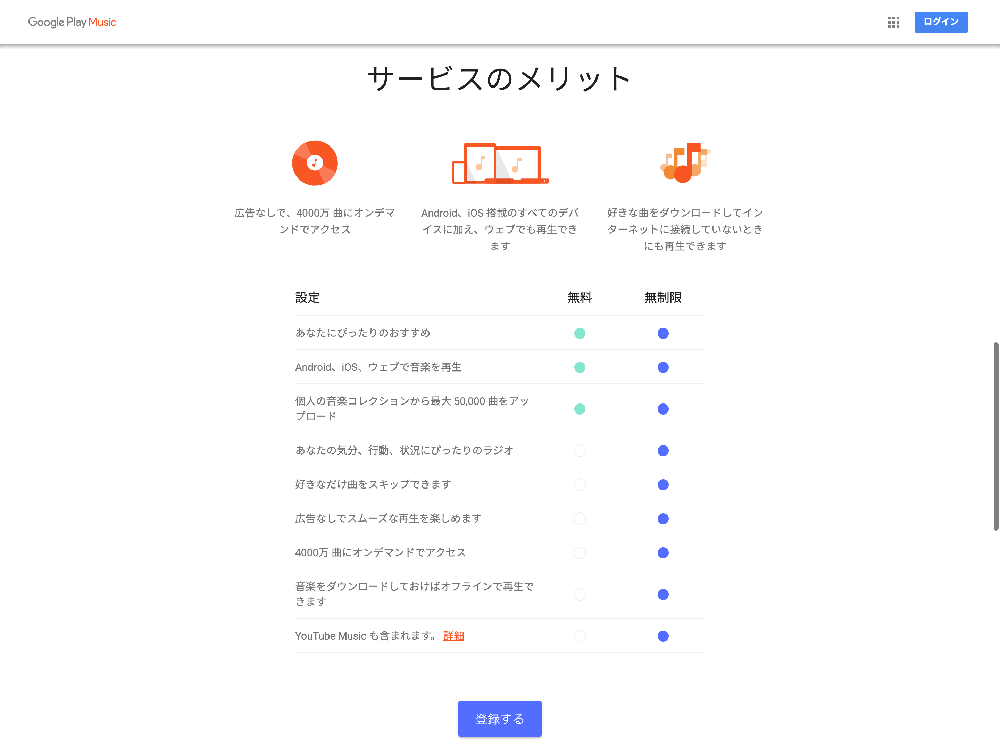

#### プラン数

2

#### プラン命名

メリット型（無料、無制限）

#### 無料プランとの比較の有無

有り

#### デザイン分類

リスト型

#### デザインから受ける印象

プランの命名が特徴的で印象に残った。

無料プランと無制限プランの共通点が3つ、ちょうどいい数な気がする（多すぎると見てて疲れる）。

### GREENa

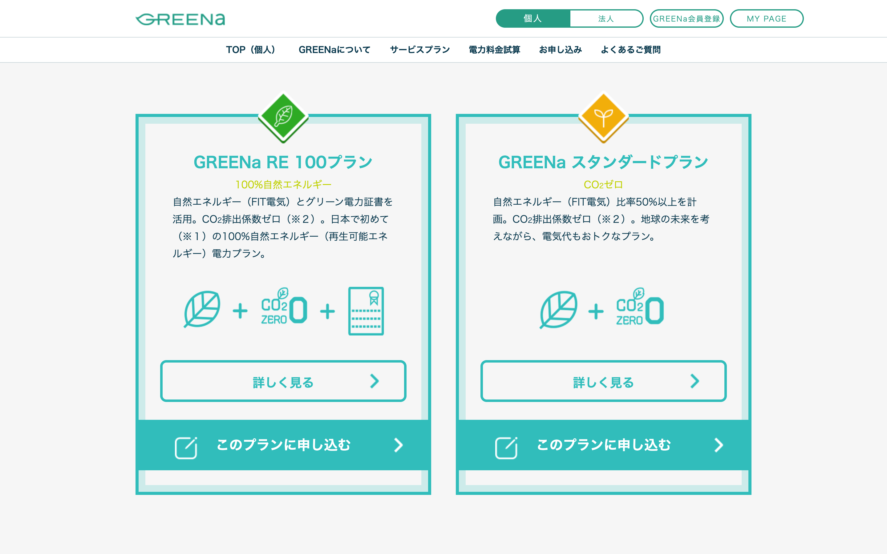

#### プラン数

2

#### プラン命名

基本とその他型（GREENa RE 100プラン、GREENa スタンダードプラン）

#### 無料プランとの比較の有無

無し（無料プランが存在しない）

#### デザイン分類

ブロック型

#### デザインから受ける印象

金額や特徴一覧が存在しないため、最初どちらのほうが上位なのかの認知が遅れた。

よく見ると枠内アイコンの数が左側のほうが多い。

具体的な特徴一覧ではなく説明文が入っている。

### 新しいKyash Card

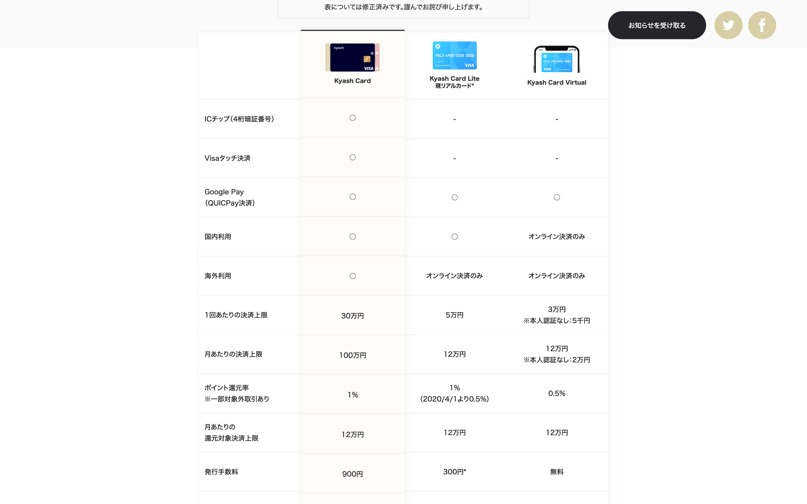

#### プラン数

3

#### プラン命名

サービス特徴型（Kyash Card、Kyash Card Lite、Kyash Card Virtual）

#### 無料プランとの比較の有無

有り（月額料金はサービスとして無く、発行手数料で比較）

#### デザイン分類

テーブル型

#### デザインから受ける印象

プラン名にそのプラン名がイメージできる画像を置いている。

一番左のプランを紹介するLPでのデザインであるため、そこが大きく目立つデザインになっている。

### LINE WORKS

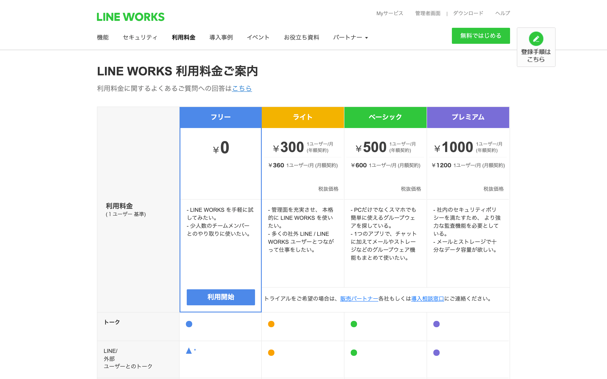

#### プラン数

4

#### プラン命名

上昇型（フリー、ライト、ベーシック、プレミアム）

#### 無料プランとの比較の有無

有り

#### デザイン分類

テーブル型

#### デザインから受ける印象

利用ユーザーのニーズが「〜〜したい」調で書かれているので、自分にあったプランがどれなのかがわかりやすい。

これは結構良い特徴だと思う。

### Nintendo Switch Online

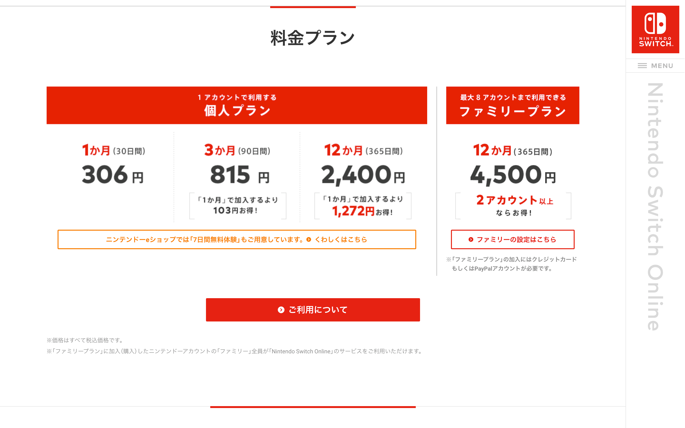

#### プラン数

4

#### プラン命名

利用者型（個人プラン、ファミリープラン）

#### 無料プランとの比較の有無

無し（無料プランが存在しない）

#### デザイン分類

ブロック型

#### デザインから受ける印象

料金のみが大きく目立っていて、どんな機能があるのかはここではわからなくなっている。
他の場所で訴求していることが前提のデザイン。

### Origin access

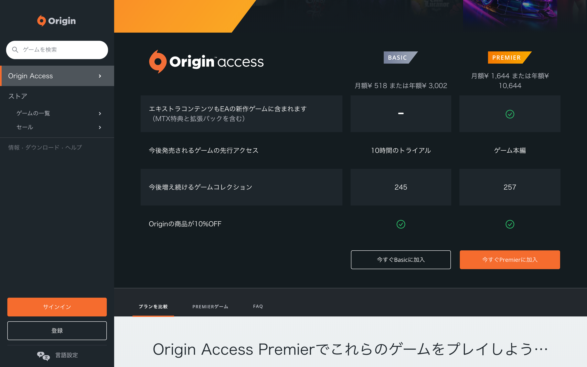

#### プラン数

2

#### プラン命名

基本とその他型（BASIC、PREMIR）

#### 無料プランとの比較の有無

無し（無料プランが存在しない）

#### デザイン分類

テーブル型（でもブロック型ぽくもある、絶妙なバランス）

#### デザインから受ける印象

比較項目がたったの4つ。

「増え続けるゲームコレクション」の数字があまり差がないので少しもやっとした。

### Qiita: Team

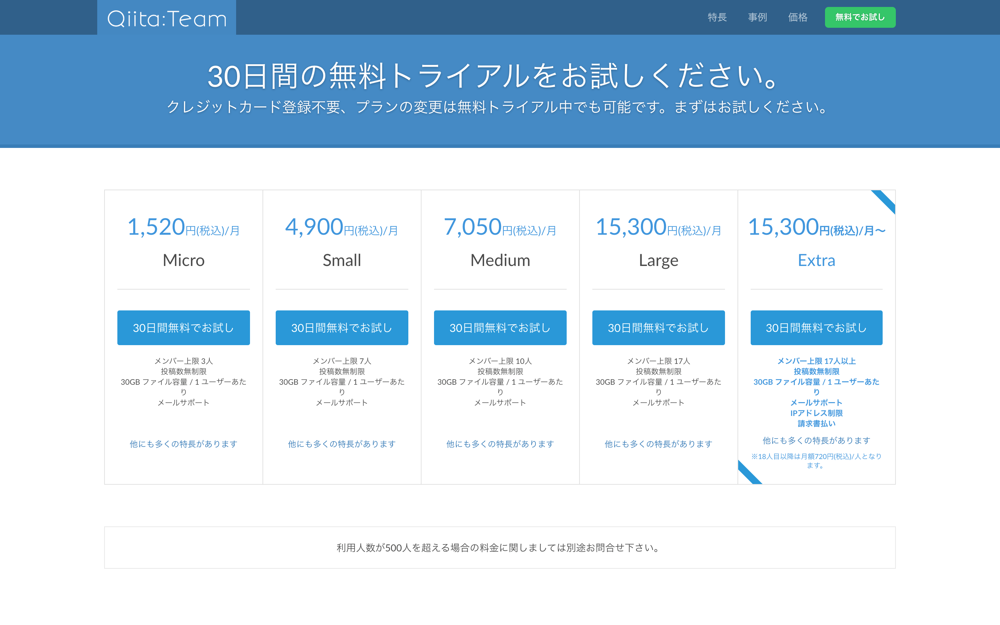

#### プラン数

5（最多）

#### プラン命名

大きさ型（Micro、Small、Medium、Large、Extra）

#### 無料プランとの比較の有無

無し（無料プランが存在しない）

#### デザイン分類

ブロック型

#### デザインから受ける印象

ずらっといろいろ書かれているが、Extra以外のプランごとの違うところ/違わないところの差が分からない。

プラン5つは少し多くて初めて見ると「うわっ」となった。

### Scrapbox

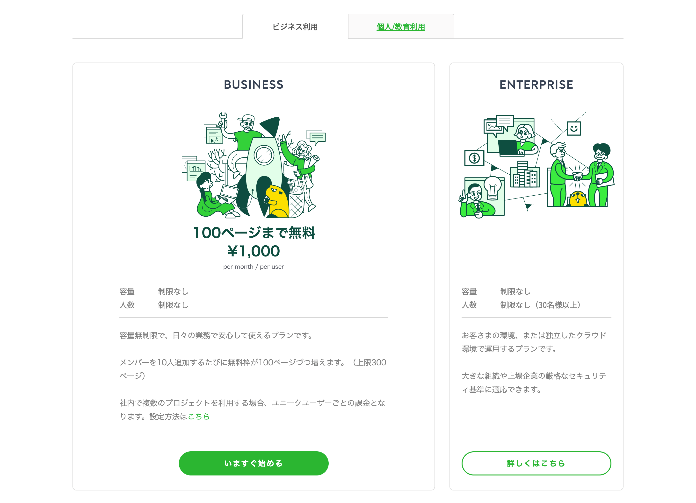

####  プラン数

3（「個人/教育利用」に遷移すると無料プランが表示される）

#### プラン命名

使用用途型（BUSINESS、ENTERPRISE、PERSONAL / EDUCATION）

#### 無料プランとの比較の有無

有り（「100ページまで無料」がその役割）

#### デザイン分類

ブロック型

#### デザインから受ける印象

利用目的から選ばせるのが印象的。

ブロック型の中でもブロックのサイズが異なるのは大きな特徴。

「みんなBUSINESSなのかな」と感じるし、そっちをとりあえず選んで良さそうと思える。
（比較対象がENTERPRISEだからなんとも…かも）

### Slack

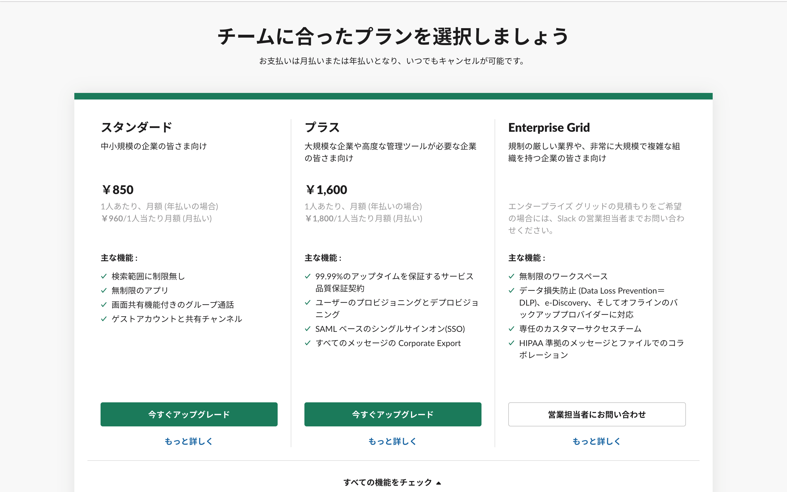

####  プラン数

3

#### プラン命名

上昇型（スタンダード、プラス、Enterprise）

#### 無料プランとの比較の有無

無し

#### デザイン分類

ブロック型

#### デザインから受ける印象

機能一覧があるものの、それぞれの機能がどう違うのかではなく「主な機能」が表示される。

プランごとを区切る線が上下端までつながっていないのは珍しい。

### Slack（ログイン前）

シークレットブラウジングでは表示が変わった。

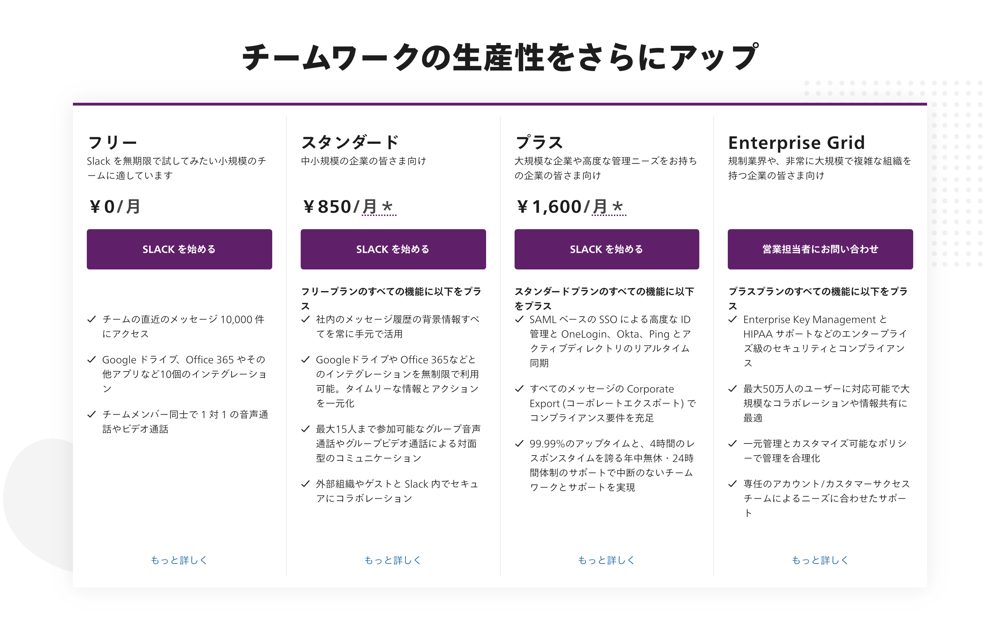

#### プラン数

4

#### プラン命名

上昇型（フリー、スタンダード、プラス、Enterprise）

#### 無料プランとの比較の有無

有り

#### デザイン分類

ブロック型

#### デザインから受ける印象

ログイン中途は違い、「〜〜のすべての機能に以下をプラス」という形で機能比較ができるようになっている。

### todoist

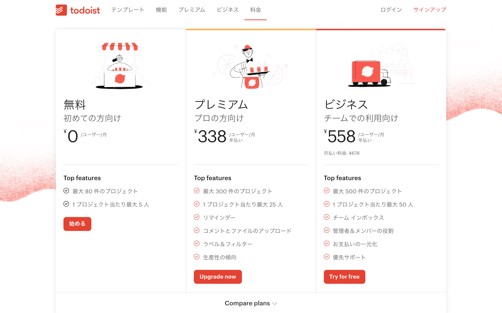

#### プラン数

3

#### プラン命名

上昇型？（無料、プレミアム、ビジネス）

#### 無料プランとの比較の有無

有り

#### デザイン分類

ブロック型

#### デザインから受ける印象

「プロの方向け」で「お、おう…僕はプロだったか」となった。

機能リストが厳密なものではなく、ビジネスはプレミアムの上位互換であることが前提として表記されている。

また、サービスの中身が独自用語で書かれているので、数字以外はあまり理解を促さない。

### WABTEDLY Admin

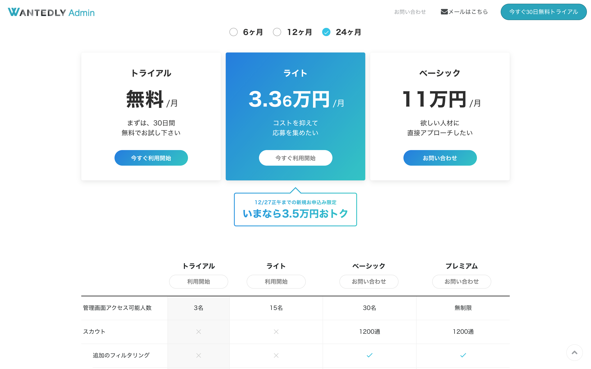

#### プラン数

4

#### プラン命名

上昇型（トライアル、ライト、ベーシック、プレミアム）

#### 無料プランとの比較の有無

有り

#### デザイン分類

ブロック型+テーブル型

#### デザインから受ける印象

まずブロックで料金と印象だけを紹介し、その後テーブルで詳しく比較する構成。
料金が大きく目に入ってくるのはビジュアルとしてよかった。
ブロックそれぞれに大きくシャドウが付いており、それぞれにhoverアクションがついているが、中のボタン以外はクリックできないことに少し困惑した。

ブロックを見るとプランが3種に見えるが、テーブルをよく見るとプランが4種有る。
テーブルの表の行数は9、多すぎるとはギリギリ感じない行数だった。

### Zeplin

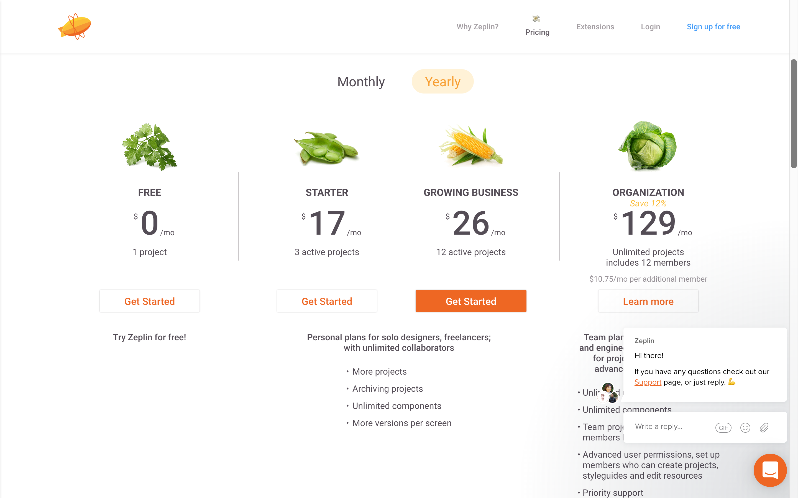

#### プラン数

4

#### プラン命名

サービス利用の熟練度型（FREE、STARTER、GROWING BUSINESS、ORGANIZATION）

#### 無料プランとの比較の有無

有り

#### デザイン分類

ブロック型？

#### デザインから受ける印象

実質、無料プランとの比較が値段の下のプロジェクト数しかない。

あと、野菜があまり理解を促すものではないので混乱のもとにもなりうる。
この画面だけ見てしまうと「農業に関わる何か…？」と勘違いする恐れがあり、社内で利用を勧めるときなどに苦労しそう。
※Zeplinはデザイナーとエンジニアを繋ぐデザインデータの共有ツール。
